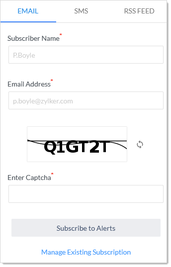
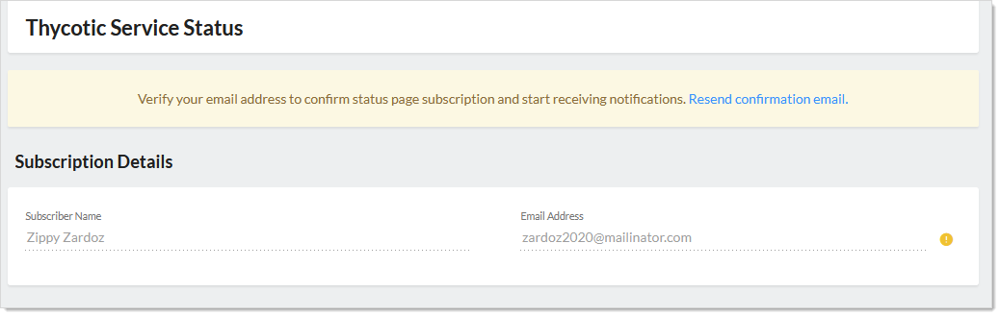
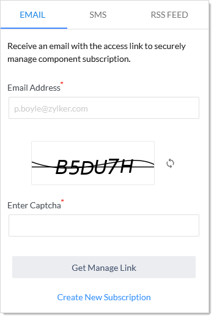

# Cloud Alert Subscriptions

## Subscribing to Alerts

1. [Open Cloud Manager](#open-cloud-manager).

1. On the **Teams** page, click the **Cloud Status** link at the top right of the page. The Thycotic Service Status page appears:

   

1. Click the Subscribe button at the top of the page. A subscription popup appears:

   

1. **Either** click the **Email** tab to have the alerts sent to an email.
   **Or** click the **SMS** tab to have text message alerts sent.
   **Or** click the **RSS Feed** tab to create an RSS feed file for alerts. Using this, you can create a status feed on your status page.

1. Click the **Subscribe to Alerts** button. The new subscription appears in the Subscription Details page:

   

1. Confirm the subscription on your phone or via email when the message arrives. THE CONFIRMATION NEVER ARRIVED.

## Viewing or Editing Alert Subscription Details

1. [Open Cloud Manager](#open-cloud-manager).

1. On the **Teams** page, click the **Cloud Status** link at the top right of the page. The Thycotic Service Status page appears:

   

1. Click the Subscribe button at the top of the page, either on the main page (receive all alerts) or on one of the components. A subscription popup appears:

   

1. Click the **Manage Existing Subscription** link.

   

1. Type the email address for the subscription management link to be sent to in the **Email Address** text box.

1. Complete the captcha.

1. Click the **Get Manage Link** button. A confirmation page appears.

1. Confirm the subscription on your phone or via email when the message arrives. THE CONFIRMATION NEVER ARRIVED.