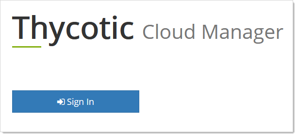
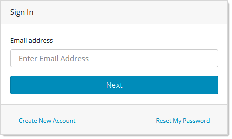
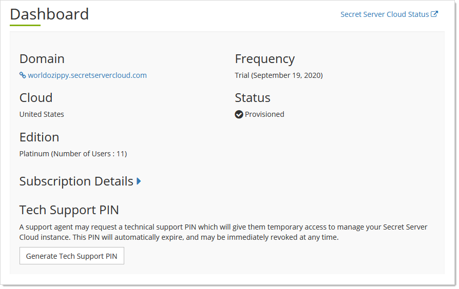
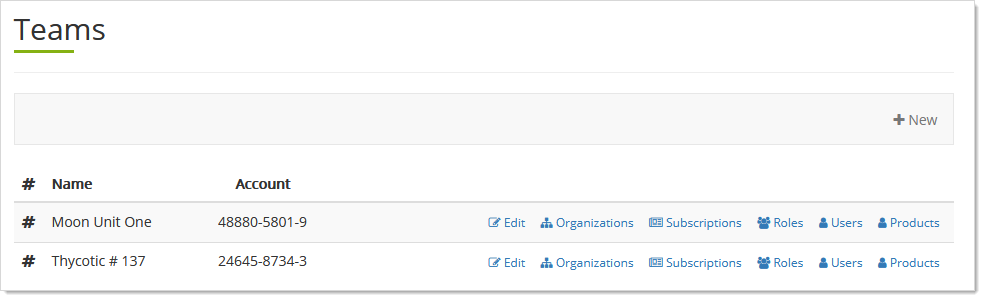
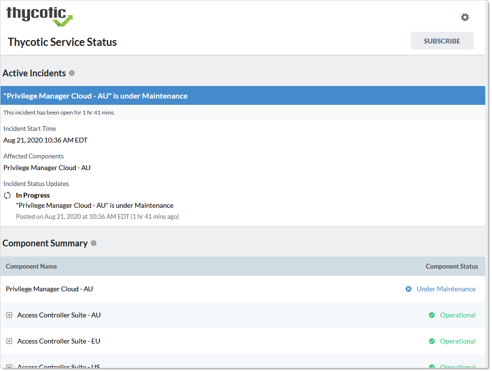
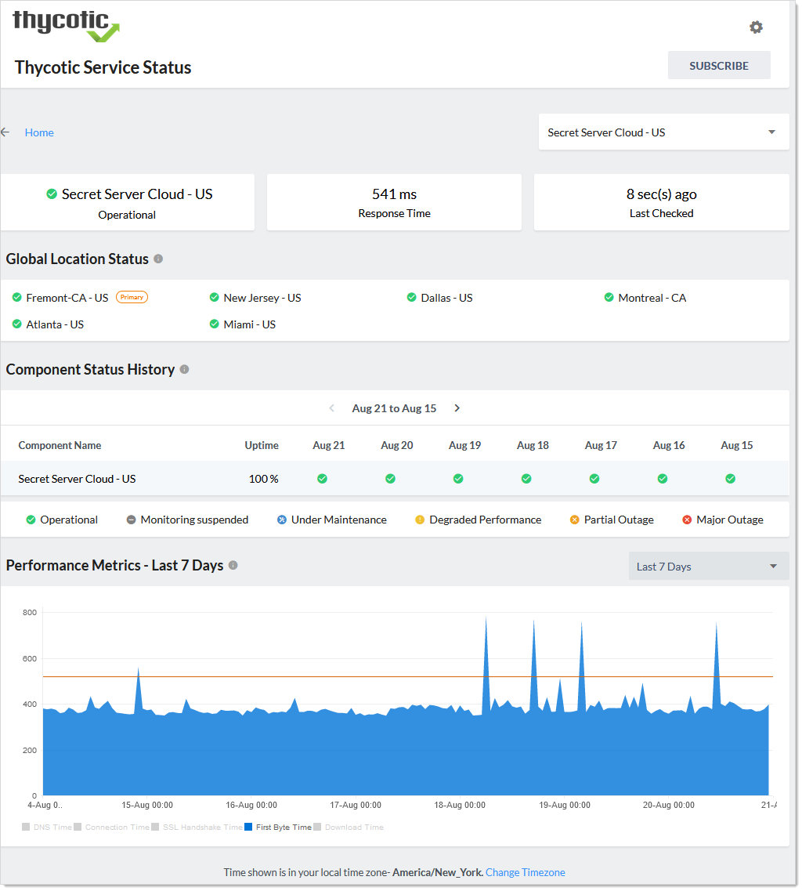

[title]: # "Cloud Manager General Procedures"
[tags]: # "Cloud Manager, Thycotic One"
[priority]: # "1000"

# Cloud Manager General Procedures

## Opening Cloud Manager

> **Note:**  if you are already logged on your Secret Server Cloud (SSC) domain, you can also access Cloud Manager by going to **Admin \> Cloud Subscriptions**, rather than completing this procedure. Click the **Thycotic Cloud Portal** link.

1. In a Web browser, navigate to the Secret Server Cloud (SSC) portal at `https://portal.thycotic.com`. The Log on page appears:

   

1. Click the **Sign In** button. The Thycotic Customer Login page appears:

   

1. Scroll down to the **Other Login Options** section.

1. Click the button for your Secret Server Cloud (SSC). We chose Thycotic One US East. The Sign In page appears:

   

1. Type your email address in the **Email Address** text box.

1. Click the **Next** button. The Password text box appears.

1. Type your password in the **Password** text box.

1. (Optional) Click to select the **Remember Me** check box if you want your log on credentials to be remembered on this computer. Only do this on secure computers that only you have access to.

1. Click the **Next** button. Your SSC dashboard appears:

   

   > **Note:** See [Understanding the Cloud Manager Dashboard](#understanding-the-dashboard) for details.

1. Click the **Manage** link at the top right and select **Teams**. The Teams page appears:

   
   The Teams page is the management page for Cloud Manager. Teams are a way to divide up your management into product instances, such as SSC or Privilege Manager, that have separate privileges, users and organization.  (See [Teams](../teams/index.md)).

## Understanding the Cloud Manager Dashboard

The Cloud Manager dashboard provides and overview of your cloud instance. It provides:

- **Cloud**: The parent cloud of your instance.
- **Domain**: The name of and a link to your cloud instance
- **Edition**: A summary of your license status and number of users.
- **Frequency**: Expiration status and subscription renewal frequency.
- **Secret Server Cloud Status**: The status of all the parent clouds and related components. It also includes their state history. See [Viewing Cloud Status](#viewing-cloud-status)
- **Subscription Details**: A dropdown that shows the details for each cloud product that you own, including the number of licenses and the expiration dates.
- **Status**: The current state your cloud instance.
- **Tech Support PIN**: A generator for a PIN that you will need if you choose to contact our technical support. See [Technical Support](../help/technical-support/index.md).

## Viewing Cloud Status

1. [Open Cloud Manager](#open-cloud-manager).

1. On the **Teams** page, click the **Cloud Status** link at the top right of the page. The Thycotic Service Status page appears:

   

1. The page has these sections:

   - **Active Incidents**: Unresolved incidents, including maintenance. Includes severity and real-time updates.
   - **Component Summary**: Operation status of various Thycotic services. Click the **+** to see subcomponent broken out.
   - **Component Status History**: A collection of the operational statuses of Thycotic service projected over the last three months. Includes a calculated uptime percentage for each.
   - **Upcoming Maintenance - Next 31 days**: Details about any scheduled downtime on the Thycotic service in the next 31 days.
   - **Incident History**: A list of resolved incidents and competed maintenance in the last seven days.

1. Click any service component or subcomponent (in the Component Summary and Component Status History sections) to view additional information. The Thycotic Service Status Page appears:

   

1. Make adjustments as desired:

   - Click the unlabeled service dropdown list at the top right to change the service without leaving the page.
   - Click the **\<**  or **\>** icons on the **Component Status History** table to adjust its time window.
   - Click the **Change Time Zone** link at the bottom of the page or the gear icon at the top of the page to change the time zone.

1. Operate the **Performance Metrics** graph:

   - Click the **Performance Metrics** dropdown list to move the time window shown.
   - Click the check boxes at the bottom to add or remove metrics from the graph. You can view:
     - Connection Time
     - DNS Time 
     - Download Time
     - First Byte Time
     - SSL Handshake Time
   - Hover the mouse pointer over the graph to see a popup showing that metric at specific time on the graph.

1. In the **Incident History** section, click the incident title to see details about the incident:

   

