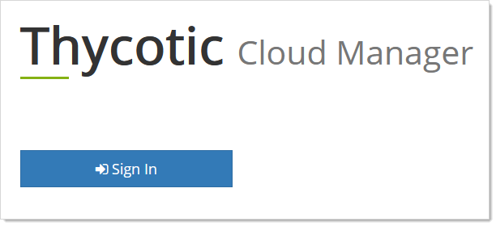
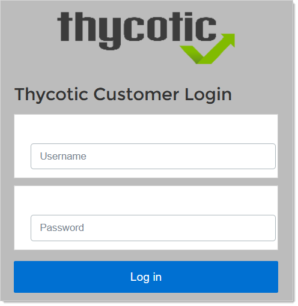
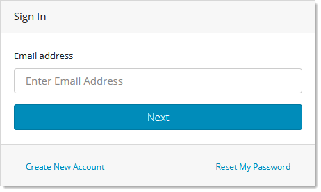
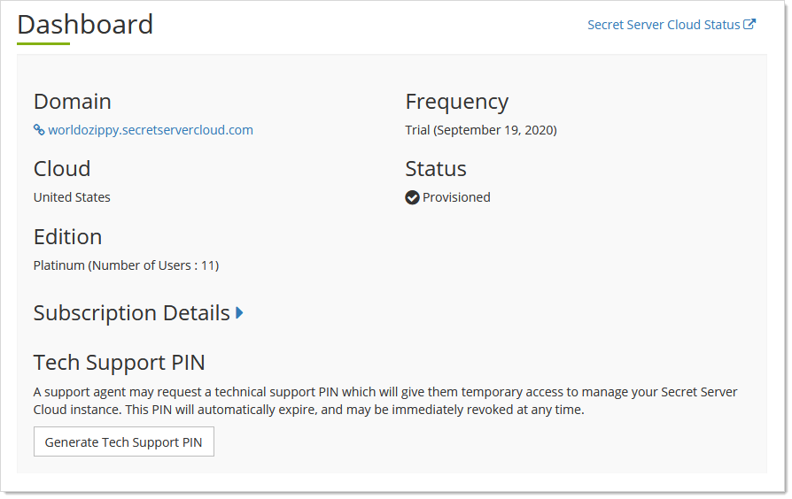

[title]: # (Cloud Manager General Procedures)
[tags]: # (Cloud Manager)
[priority]: # (1000)

# Cloud Manager General Procedures

## Opening Cloud Manager

> **Note:**  if you are already logged on your Secret Server Cloud (SSC) domain, you can also access Cloud Manager by going to **Admin \> Cloud Subscriptions**, rather than completing this procedure. Click the **Thycotic Cloud Portal** link.

1. In a Web browser, navigate to the Secret Server Cloud (SSC) portal at `https://portal.thycotic.com`. The Log on page appears:

   

1. Click the **Sign In** button. The Thycotic Customer Login page appears:

   

1. Scroll down to the **Other Login Options** section.

1. Click the button for your Secret Server Cloud (SSC). We chose Thycotic One US East. The Sign In page appears:

   

1. Type your email address in the **Email Address** text box.

1. Click the **Next** button. The Password text box appears.

1. Type your password in the **Password** text box.

1. (Optional) Click to select the **Remember Me** check box if you want your log on credentials to be remembered on this computer. Only do this on secure computers that only you have access to.

1. Click the **Next** button. Your Cloud Manager dashboard appears:

   

   > **Note:** See [Understanding the Cloud Manager Dashboard](#understanding-the-cloud-manager-dashboard) for details.

1. Click the **Manage** link at the top right of the page and select **Teams**. The Teams page appears:

   
   The Teams page is the management page for Cloud Manager. Teams are a way to divide up your management into product instances, such as SSC or Privilege Manager, that have separate privileges, users and organization.  (See [Teams](../teams/index.md)).

## Understanding the Cloud Manager Dashboard

The Cloud Manager dashboard provides and overview of your cloud instance. It provides:

- **Cloud**: The parent cloud of your instance.

- **Domain**: The name of and a link to your cloud instance

- **Edition**: A summary of your license status and number of users.

- **Frequency**: Expiration status and subscription renewal frequency.

- **Secret Server Cloud Status**: The status of all the Thycotic clouds and related components. It also includes their state history. See [Viewing Cloud Status](#viewing-cloud-status)

- **Subscription Details**: A dropdown that shows the details for each cloud product that you own, including the number of licenses and the expiration dates.

- **Status**: The current state of your cloud instance:

  - Canceled

  - Provisioned

  - Provisioning in Progress…

  - Error During Provisioning

  - Not Provisioned.

- **Tech Support PIN**: A generator for a PIN that you will need if you choose to contact our technical support. See [Technical Support](../help/tech-support/index.md).
