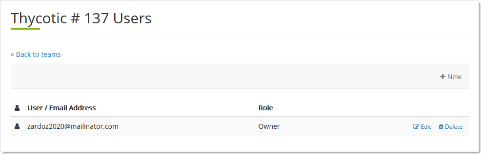

[title]: # (Cloud Manager Teams)
[tags]: # (Thycotic One, Cloud Manager, Teams)
[priority]: # (1000)

# Cloud Manager Teams

## Understanding Teams

Teams are a feature of Cloud Manager that controls access to Cloud Manager features. For example, they determine who can:

- See a subscription or product
- Generate technical support PINs
- Provision cloud instances
- Change hostnames

Generally, teams apply to admins, not regular users. You might have more than one team if you have multiple subscriptions (SSC instances) or products (other Thycotic Cloud products). Thycotic One organizations each belong to a single Cloud Manager team.

> **Note:** Please see [Thycotic One Organizations](../thycotic-one-organizations/index.md) to contrast with teams. Teams apply to Cloud Manager and organizations apply to Thycotic One. Team ownership of specific organizations bridge the two.

## Editing Team Names

1. Log on to your Cloud Manager at `portal.thycotic.com`.
1. Click the **Manage** link on the dashboard. The Teams page appears.
1. Click the **Edit** button for the desired team. A popup appears.
1. Type the desired name in the **Name** text box.
1. Click the **Save Changes** button.

## Setting a Team Role for Users

1. Log on to your Cloud Manager at `portal.thycotic.com`.

1. Click the **Manage** link on the dashboard. The Teams page appears.

1. Click the **Users** button for the desired team. A Users page appears:

   

1. Click the **Edit** button. The User Role popup appears:

   

1. Click the **Role** dropdown list to select the role for the Team's users.

1. Click the **Save** button.