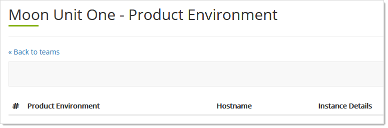

[title]: # (Team Products)
[tags]: # ( Cloud Manager, Products)
[priority]: # (1000)

# Team Products

*Products* are Thycotic cloud products other than SSC, such as Privilege Manager Cloud, DevOps Vault, and Account Lifecyle Manager. Subscriptions are essentially the exact same thing for SSC.

> **Note:** The reason there are two names for nearly the same thing is they came from separate legacy development paths. We intend to combine them in a future Cloud Manager release.

## Viewing Team Products

1. Log on to your Cloud Manager at `portal.thycotic.com`.

1. Click the **Manage** link and select **Teams**. The Teams page appears.

1. Click the **Products** button for your desired team. The Product Environment page appears:

   

1. Behold the empty page. What exactly is a product, what can we do with them?

