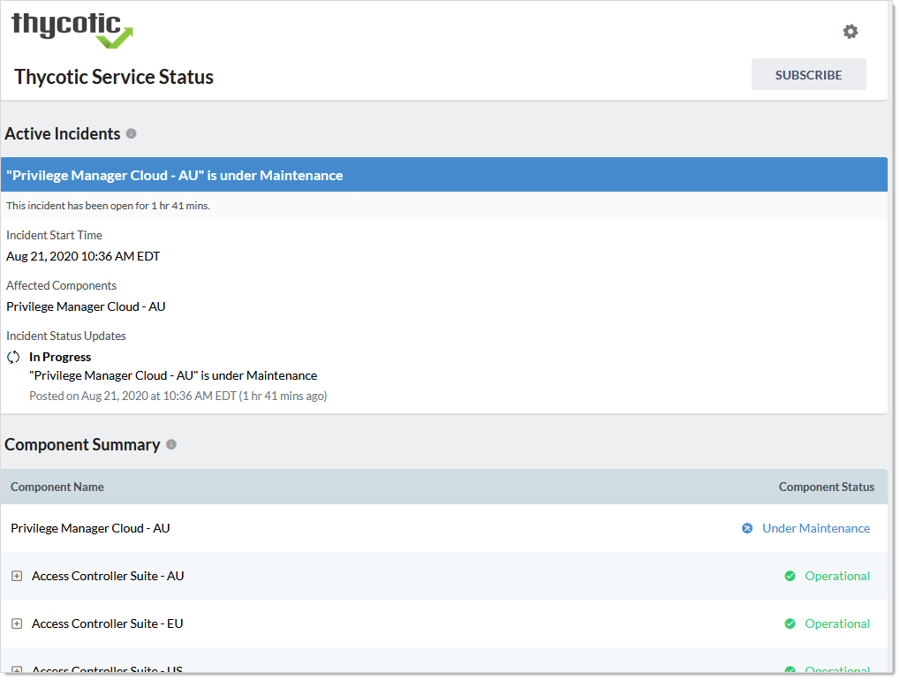
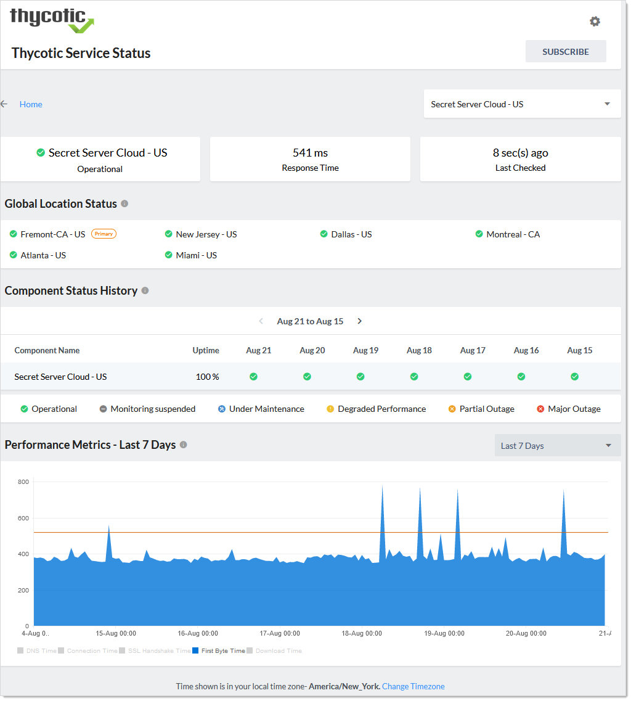
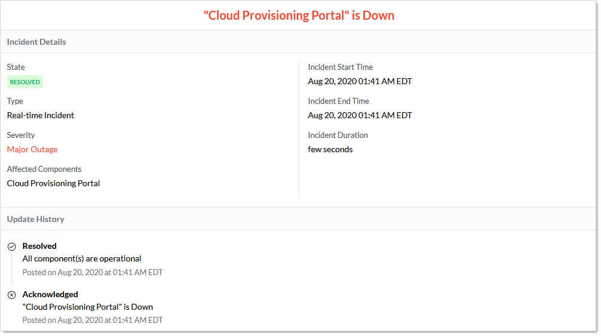
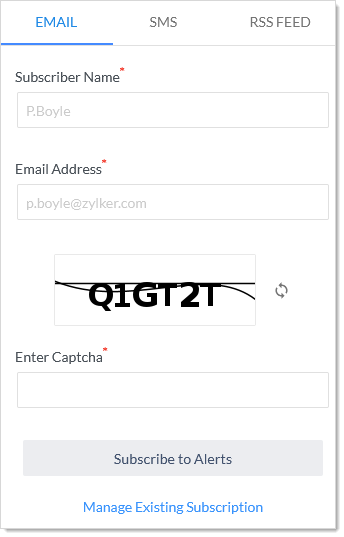
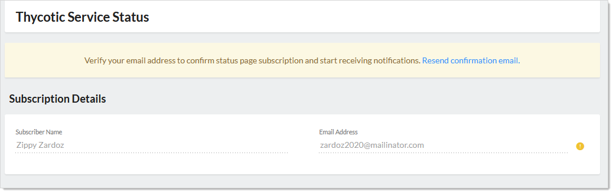
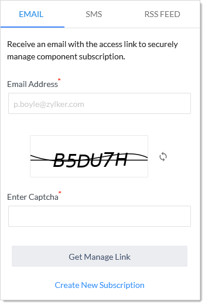

[title]: # "Cloud Status"
[tags]: # "status,Cloud Manager"
[priority]: # "1000"

# Cloud Status

## Viewing Cloud Status

1. Log on to your Cloud Manager at `portal.thycotic.com`.

1. Click the **Manage** link and select **Teams**. The Teams page appears.

1. Click the **Cloud Status** link at the top right of the page. The Thycotic Service Status page appears:

   

1. The page has these sections:

   - **Active Incidents**: Unresolved incidents, including maintenance. Includes severity and real-time updates.
   - **Component Summary**: Operation status of various Thycotic services. Click the **+** to see subcomponent broken out.
   - **Component Status History**: A collection of the operational statuses of Thycotic service projected over the last three months. Includes a calculated uptime percentage for each.
   - **Upcoming Maintenance - Next 31 days**: Details about any scheduled downtime on the Thycotic service in the next 31 days.
   - **Incident History**: A list of resolved incidents and competed maintenance in the last seven days.

1. Click any service component or subcomponent (in the Component Summary and Component Status History sections) to view additional information. The Thycotic Service Status Page appears:

   

1. Make adjustments as desired:

   - Click the unlabeled service dropdown list at the top right to change the service without leaving the page.
   - Click the **\<**  or **\>** icons on the **Component Status History** table to adjust its time window.
   - Click the **Change Time Zone** link at the bottom of the page or the gear icon at the top of the page to change the time zone.

1. Operate the **Performance Metrics** graph:

   - Click the **Performance Metrics** dropdown list to move the time window shown.
   - Click the check boxes at the bottom to add or remove metrics from the graph. You can view:
     - Connection Time
     - DNS Time 
     - Download Time
     - First Byte Time
     - SSL Handshake Time
   - Hover the mouse pointer over the graph to see a popup showing that metric at specific time on the graph.

1. In the **Incident History** section, click the incident title to see details about the incident:

   

# Cloud Alert Subscriptions

## Subscribing to Alerts

1. Log on to your Cloud Manager at `portal.thycotic.com`.

1. Click the **Manage** link and select **Teams**. The Teams page appears.

1. Click the **Cloud Status** link at the top right of the page. The Thycotic Service Status page appears:

   

1. Click the Subscribe button at the top of the page. A subscription popup appears:

   

1. **Either** click the **Email** tab to have the alerts sent to an email.
   **Or** click the **SMS** tab to have text message alerts sent.
   **Or** click the **RSS Feed** tab to create an RSS feed file for alerts. Using this, you can create a status feed on your status page.

1. Click the **Subscribe to Alerts** button. The new subscription appears in the Subscription Details page:

   

1. Confirm the subscription on your phone or via email when the message arrives. WILL NOTE: THE CONFIRMATION NEVER ARRIVED, SO I DON'T KNOW WHAT COMES NEXT.

## Viewing or Editing Alert Subscription Details

1. [Open Cloud Manager](#open-cloud-manager).

1. On the **Teams** page, click the **Cloud Status** link at the top right of the page. The Thycotic Service Status page appears:

   

1. Click the Subscribe button at the top of the page, either on the main page (receive all alerts) or on one of the components. A subscription popup appears:

   

1. Click the **Manage Existing Subscription** link.

   

1. Type the email address for the subscription management link to be sent to in the **Email Address** text box.

1. Complete the captcha.

1. Click the **Get Manage Link** button. A confirmation page appears.

1. Confirm the subscription on your phone or via email when the message arrives. THE CONFIRMATION NEVER ARRIVED, SO I DON'T KNOW WHAT COMES NEXT.