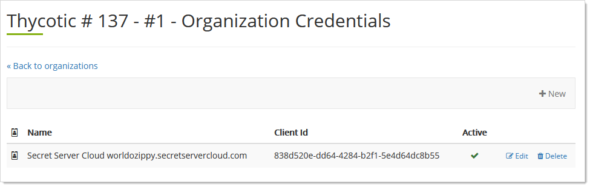
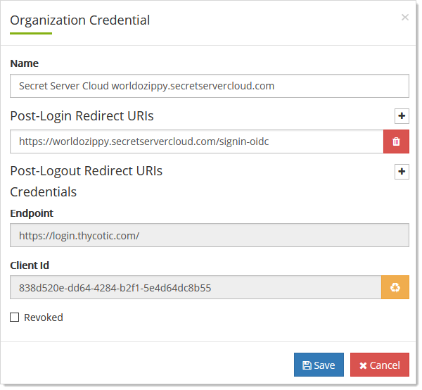

[title]: # (Thycotic One Team Application Credentials)
[tags]: # (Thycotic One, Cloud Manager, application, credentials, organizations)
[priority]: # (1000)

# Thycotic One Team Application Credentials

An *team application credential* is a client ID and client secret that applications, such as Secret Server Cloud, use to  connect to Thycotic One and authenticate against it. Credentials can also push user accounts into Thycotic One. For example, SSC syncs its user account list with Thycotic One when that option is enabled. All those users belong to the original organization, which is set up for them when they provision the instance.

## Editing Credentials

1. Log on to your Cloud Manager at `portal.thycotic.com`.

1. Click the **Manage** link and select **Teams**. The Teams page appears.

1. Click the **Organizations** button for the desired team. The Thycotic One Organizations page appears:

   

1. Click the **Credentials** button. The Organization Credentials page appears:

   

1. Click the **Edit** button next to the desired credential. The Organization Credential page appears:

   

1. Edit the controls as follows:

   - **Name**: This name appears somewhere. ANY CONSIDERATIONS?

   - **Post-Login Redirect URIs**: Location where your users are redirected for log on. Click the **+** to add URLs to the list. Click the red trashcan button to delete one. WILL NOTE: THE VALUES SHOWN ARE URLS, NOT URIS. CAN YOU REALLY USE URIS? I DON'T UNDERSTAND HOW YOU CAN BE REDIRECTED TO MORE THAN ONE PLACE. YOU CHOOSE BETWEEN THEM ELSEWHERE?

   - **Post-Logout Redirect URIs Credentials**: Location where your users are redirected upon log off. It includes the endpoint URL and the client ID. It is read only for the Thycotic One log on. Click the **+** to add URLs to the list.  Click the red trashcan button to delete one. WILL NOTE: I DON'T UNDERSTAND HOW YOU CAN BE REDIRECTED TO MORE THAN ONE PLACE. YOU CHOOSE BETWEEN THEM ELSEWHERE?

   - **Revoked**: Click to select this if you wish to revoke the credential. WILL NOTE: WHY NOT JUST DELETE IT?

1. Click the **Save** button.

## Viewing the Client ID

See [Editing Credentials](#editing-credentials).

## Viewing and Editing the Post-login Redirect URI

See [Editing Credentials](#editing-credentials)

## Viewing the Post-logout Redirect URI

See [Editing Credentials](#editing-credentials)

## Setting External Authorization Providers

See [Editing Credentials](#editing-credentials).