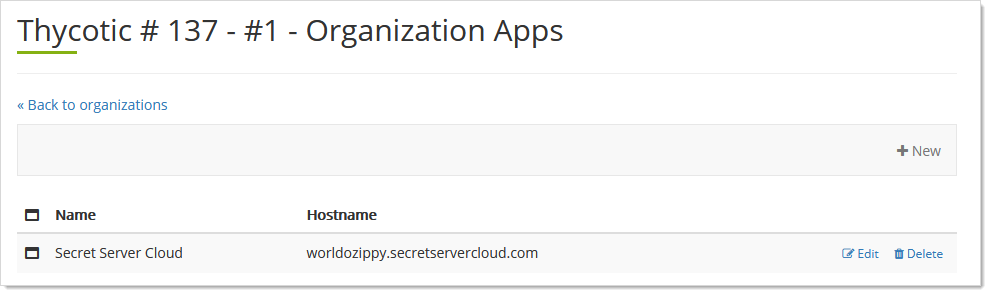
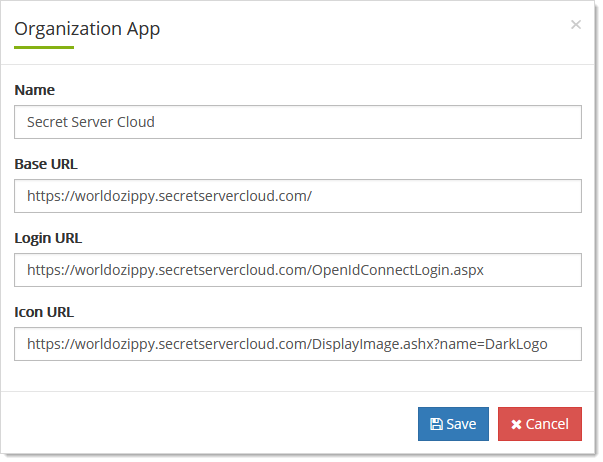

[title]: # "Thycotic One Team Organization Applications"
[tags]: # "Thycotic One, Cloud Manager, Organizations, Applications"
[priority]: # "1000"

# Thycotic One Team Organization Applications

Applications are those applications that you want to run under Thycotic One single sign on. They can be from Thycotic or third parties and cloud-based or on-premises. The configured applications appear on your Thycotic One log on page.

## Adding Applications

1. DO WHAT YOU NEED TO DO THE MAKE THE APP APPEAR AS AN OPTION LATER ON.

1. Log on to your Cloud Manager at `portal.thycotic.com`.

1. Click the **Manage** link on the dashboard. The Teams page appears.

1. Click the **Organizations** button for the desired team. The Thycotic One Organizations page appears:

   

1. Click the **Apps** button. The Organization Apps page appears:

   

1. Click the **+ New** button. The application appears in the Organization Apps page.

## Deleting Applications

1. Log on to your Cloud Manager at `portal.thycotic.com`.

1. Click the **Manage** link on the dashboard. The Teams page appears.

1. Click the **Organizations** button for the desired team. The Thycotic One Organizations page appears:

   

1. Click the **Apps** button. The Organization Apps page appears:

   

1. Click the **Delete** button next to the desired application.

## Editing Secret Server Cloud and Other Applications

1. Log on to your Cloud Manager at `portal.thycotic.com`.

1. Click the **Manage** link on the dashboard. The Teams page appears.

1. Click the **Organizations** button for the desired team. The Thycotic One Organizations page appears:

   

1. Click the **Apps** button. The Organization Apps page appears:

   

1. Click the **Edit** button next to your SSC instance or other application. The Organization App popup page appears:

   

1. Edit the **Base URL**, **Login URL**, and Editing Secret Server Cloud and Other Applications text boxes as desired. DOES ANYTHING FUNKY HAPPEN IF YOU CHANGE THE APP NAME?

1. Click the **Save** button.

## Setting Application Links

See [Editing Secret Server Cloud and Other Applications](#editing-secret-server-cloud-and-other-applications).

## Setting Expiration Dates

