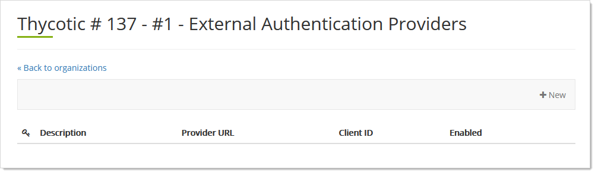
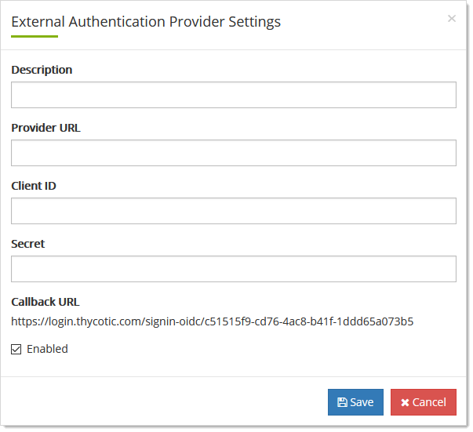
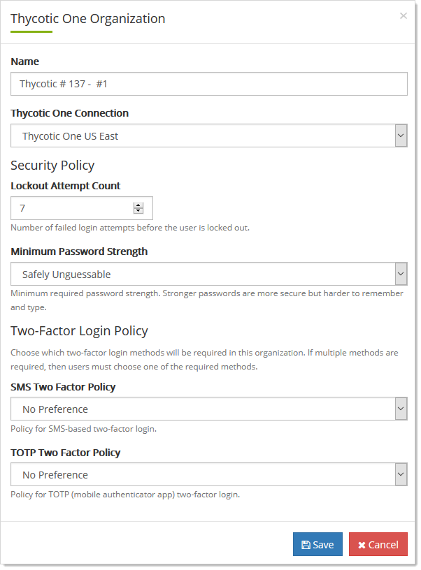

[title]: # (Thycotic One Organization General)
[tags]: # (Thycotic One, Cloud Manager, Organizations)
[priority]: # (1000)

# Team Organization General

## Adding External Authorization Providers

1. Log on to your Cloud Manager at `portal.thycotic.com`.

1. Click the **Manage** link on the dashboard. The Teams page appears.

1. Click the **Organizations** button for the desired team. The Thycotic One Organizations page appears:

   

1. Click the **Auth Providers** button for the desired organization. The External Authentication Providers page appears:

   

1. Click the **+ New** button. The External Authentication Provider Setting popup page appears:

   

1. Type in the parameters for your desired provider. **Secret** is the SSC secret used to connect to and authenticate with the provider. **Callback URL** is the URL used by the provider after the authentication is complete to communicate with SSC.

1. Click to select the **Enabled** check box. You can deselect it if you wish to enter the authentication provider without using it yet.

1. Click the **Save** button.

## Editing Organization Settings

1. Log on to your Cloud Manager at `portal.thycotic.com`.

1. Click the **Manage** link on the dashboard. The Teams page appears.

1. Click the **Organizations** button for the desired team. The Thycotic One Organizations page appears:

   

1. Click the **Edit** button. The Organization page appears: 

   

1. Name and cloud region:

   - Edit the name in the **Name** text box. RAMIFICATIONS OF CHANGING THIS?

   - Click to select the Thycotic cloud region in the **Thycotic One Connection** dropdown list. WILL NOTE: RAMIFICATIONS OF CHANGING THIS?

1. Log on security:

   - Click the **Lockout Attempt Count** list to select the number of log on tries a user is allowed before being locked out.
   - Click the **Minimum Password Strength** dropdown list to choose the password robustness to enforce.

1. Two-Factor authentication: Click the TOTP Two Factor Policy to enforce a time-based one-time password setup.

1. Click the **Save** button.

## Setting the Lockout Policy

See [Editing Organization Settings](#editing-organization-settings).

## Setting the Multifactor Authentication Policy

See [Editing Organization Settings](#editing-organization-settings).

## Setting the Password Policy

See [Editing Organization Settings](#editing-organization-settings).

## Setting Thycotic One Regions

See [Editing Organization Settings](#editing-organization-settings).

