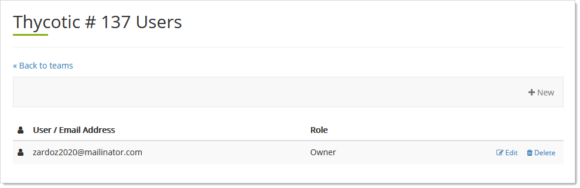
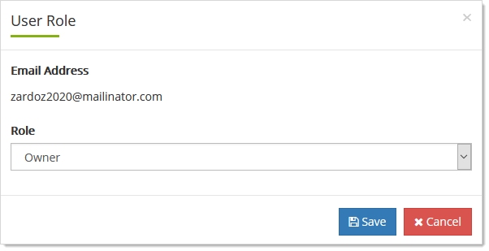

[title]: # "Thycotic One Teams"
[tags]: # "Thycotic One, Cloud Manager, Teams"
[priority]: # "1000"

# Thycotic One Teams

## Understanding Teams

Teams are a way to divide up your management into product instances, such as SSC or Privilege Manager, that have separate privileges, users and organizations. 

## Editing Team Names

1. Log on to your Cloud Manager at `portal.thycotic.com`.
1. Click the **Manage** link on the dashboard. The Teams page appears.
1. Click the **Edit** button for the desired team. A popup appears.
1. Type the desired name in the **Name** text box.
1. Click the **Save Changes** button.

## Setting a Team's Role for Users

1. Log on to your Cloud Manager at `portal.thycotic.com`.

1. Click the **Manage** link on the dashboard. The Teams page appears.

1. Click the **Users** button for the desired team. A Users page appears:

   

1. Click the **Edit** button. The User Role popup appears:

   

1. Click the **Role** dropdown list to select the role for the Team's users.

1. Click the **Save** button.