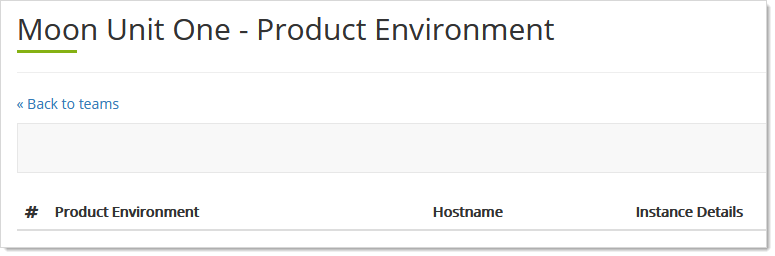

[title]: # "Products"
[tags]: # "Thycotic One, Cloud Manager, Products"
[priority]: # "1000"

# Thycotic One Team Products

WILL NOTE: WHAT IS A PRODUCT, AND WHAT CAN WE DO WITH THEM? READ ONLY? HOW DOES A PRODUCT DIFFER FROM A SUBSCRIPTION?

## Viewing Team Products

1. Log on to your Cloud Manager at `portal.thycotic.com`.

1. Click the **Manage** link and select **Teams**. The Teams page appears.

1. Click the **Products** button for your desired team. The Product Environment page appears:

   

1. Behold the empty page. What exactly is a product, what can we do with them?

