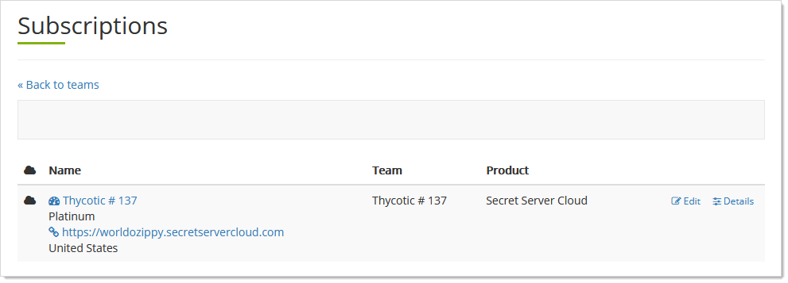
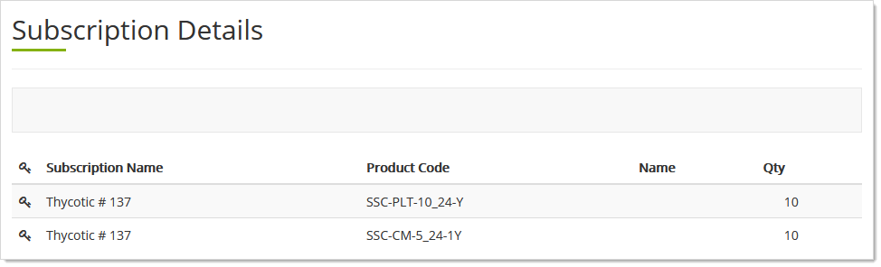
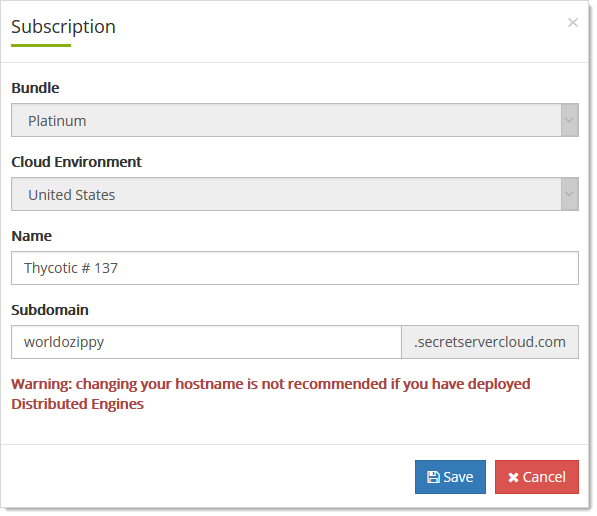

[title]: # "Thycotic One Team Cloud Subscriptions"
[tags]: # "Thycotic One, Cloud Manager"
[priority]: # "1000"

# Thycotic One Team Cloud Subscriptions

## Viewing and Editing Team Subscriptions

> **Note:** The Cloud Manager dashboard provides a much quicker way to view team subscriptions.

1. Log on to your Cloud Manager at `portal.thycotic.com`.

1. Click the **Manage** link and select **Teams**. The Teams page appears.

1. Click the **Subscriptions** button for the desired team. The Subscriptions page appears:

   

1. To view a list of the cloud subscriptions, click the **Details** button. The Subscriptions Details page appears:

   

   We see that the team is listed under Subscription Name, and the subscriptions are for SSC Connection Manager and the SSC platform.

1. To edit the subscriptions, click the **Edit** button. The Subscription popup appears:

   

1. If desired, type the new hostname in the **Name** text box.

   > **Important:** Do not do this if you have deployed distributed engines. This will cause issues.

1. If desired, type the new subdomain name in the **Subdomain** text box.

1. Click the **Save** button.

## Editing the Subdomain

See [Viewing and Editing Team Subscriptions](#viewing-and-editing-team-subscriptions).

## Linking to an Instance

## Listing Cloud Subscriptions

See [Viewing and Editing Team Subscriptions](#viewing-and-editing-team-subscriptions).

## Listing Hostnames

See [Viewing and Editing Team Subscriptions](#viewing-and-editing-team-subscriptions).

