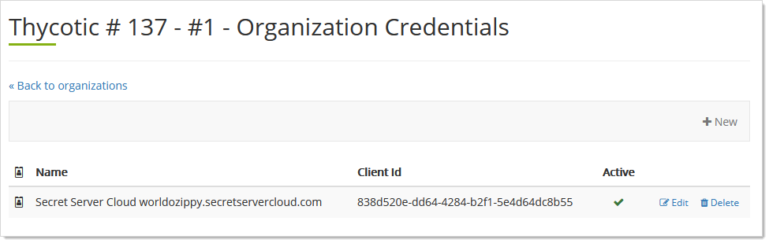
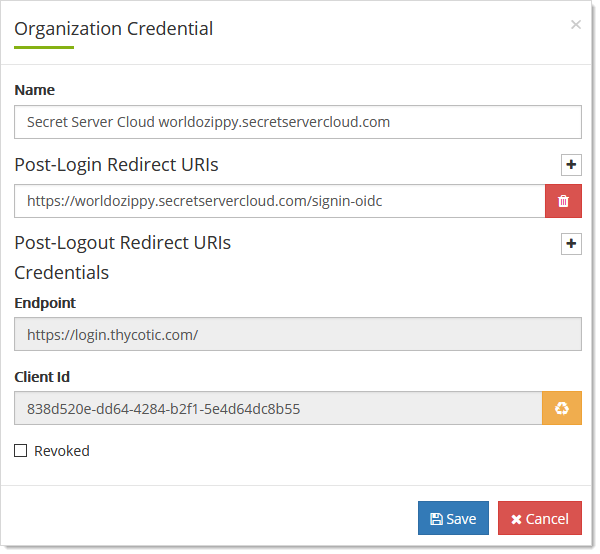

[title]: # (Thycotic One Application Credentials)
[tags]: # (Thycotic One, Cloud Manager, application, credentials, organizations)
[priority]: # (1000)

# Thycotic One Application Credentials

An *application credential* is an OpenID Connect client ID and client secret that applications, such as Secret Server Cloud, use to  connect to Thycotic One and authenticate against it. Credentials can also push user accounts into Thycotic One. For example, SSC syncs its user account list with Thycotic One when that option is enabled. All those users belong to the original organization, which is set up for them when they provision the instance.

## Editing Credentials

1. Log on to your Cloud Manager at `portal.thycotic.com`.

1. Click the **Manage** link and select **Teams**. The Teams page appears.

1. Click the **Organizations** button for the desired team. The Thycotic One Organizations page appears:

   

1. Click the **Credentials** button. The Organization Credentials page appears:

   

1. Click the **Edit** button next to the desired credential. The Organization Credential page appears:

   

1. Edit the controls as follows:

   - **Name**: A display name for this credential.

   - **Post-Login Redirect URIs**: Allowed callback URLs to which the user may be redirected after logging in. These are typically provided by the application that users will be logging into. The redirect URI provided during the login process must match one of these URIs exactly, or the login will fail.

   - **Post-Logout Redirect URIs Credentials**: Allowed callback URLs to which the user may be redirected after logging out. These are optional, and only supported if the consuming application supports this feature.

   - **Revoked**: Click to select this if you wish to revoke the credential. This can be used if you want to temporarily disable a credential, but not permanently delete it.

1. Click the **Save** button.

## Viewing the Client ID

See [Editing Credentials](#editing-credentials).

## Viewing and Editing the Post-login Redirect URI

See [Editing Credentials](#editing-credentials)

## Viewing the Post-logout Redirect URI

See [Editing Credentials](#editing-credentials)

## Setting External Authorization Providers

See [Editing Credentials](#editing-credentials).