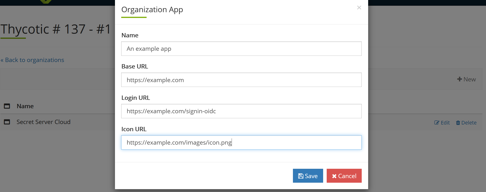

[title]: # (Thycotic One Organization Applications)
[tags]: # (Thycotic One, Cloud Manager, Organizations, Applications)
[priority]: # (1000)

# Thycotic One Organization Applications

Organization *applications* are subscriptions (SSC instances), products (other Thycotic cloud products), Thycotic on-premises applications, or even third-party cloud or on-premises applications that run under Thycotic One single sign on, that is, to appear on your Thycotic One log on page. The configured applications appear on your Thycotic One log on page. 

<!--

> **Note:** It is possible to have subscriptions and products that are *not* applications—applications are integrated with the Thycotic One log on.

## Adding Applications

1. Log on to your Cloud Manager at `portal.thycotic.com`.

1. Click the **Manage** link on the dashboard. The Teams page appears.

1. Click the **Organizations** button for the desired team. The Thycotic One Organizations page appears:

   

1. Click the **Apps** button. The Organization Apps page appears:

   

1. Click the **+ New** button. WILL NOTE: Not sure what happens next—it blew up:

   

-->

## Deleting Applications

1. Log on to your Cloud Manager at `portal.thycotic.com`.

1. Click the **Manage** link on the dashboard. The Teams page appears.

1. Click the **Organizations** button for the desired team. The Thycotic One Organizations page appears:

   

1. Click the **Apps** button. The Organization Apps page appears:

   

1. Click the **Delete** button next to the desired application.

## Editing Secret Server Cloud and Other Applications

1. Log on to your Cloud Manager at `portal.thycotic.com`.

1. Click the **Manage** link on the dashboard. The Teams page appears.

1. Click the **Organizations** button for the desired team. The Thycotic One Organizations page appears:

   

1. Click the **Apps** button. The Organization Apps page appears:

   

1. Click the **Edit** button next to your SSC instance or other application. The Organization App popup page appears:

   

1. Edit the provided settings as desired.

1. Click the **Save** button.

## Setting Application Links

See [Editing Secret Server Cloud and Other Applications](#editing-secret-server-cloud-and-other-applications).

## Setting Expiration Dates

