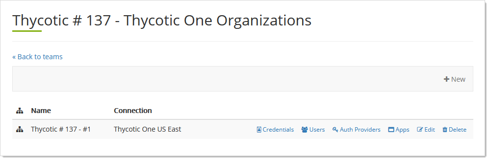
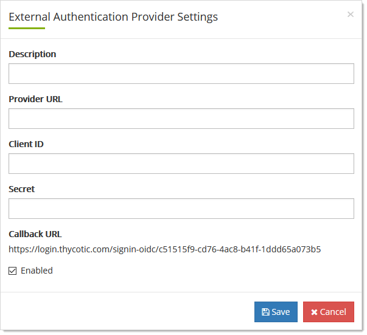
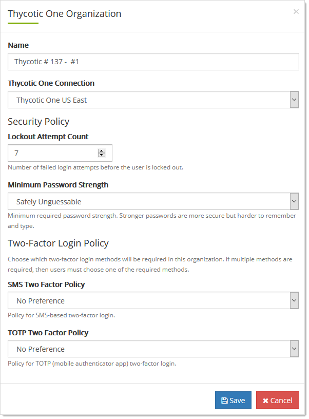

[title]: # (Organization General Procedures)
[tags]: # (Thycotic One, Organizations)
[priority]: # (1000)

# Organization General Procedures

## Adding External Authentication Providers

Thycotic One supports external OpenID Connect authentication providers. During a user's login, if an organization has configured one or more external providers, the user will be prompted to select which provider to use, or to log in with a Thycotic One account password.

1. Log on to your Cloud Manager at `portal.thycotic.com`.

1. Click the **Manage** link on the dashboard. The Teams page appears.

1. Click the **Organizations** button for the desired team. The Thycotic One Organizations page appears:

   

1. Click the **Auth Providers** button for the desired organization. The External Authentication Providers page appears:

   

1. Click the **+ New** button. The External Authentication Provider Setting popup page appears:

   

1. Type in the parameters for your desired provider.

    - **Description** is a display name.

    - **Provider URL** is the OpenID Connect base server URL of the external provider. Specifically, this must be a publicly accessible URL from which the OpenID Connect configuration document can be fetched. For example, if the OpenID Connect configuration document is available at `https://example.com/.well-known/openid-configuration`, then this setting should be set to `https://example.com`.
    
    - **Client ID** and **Secret** are the credentials used to connect to and authenticate with the provider.
    
    - **Callback URL** is the redirect URI required to complete the OpenID Connect login process. In most cases, the external provider must be configured to allow this specific URL.

1. Click to select the **Enabled** check box. You can deselect it if you wish to enter the authentication provider without using it yet.

1. Click the **Save** button.

## Editing Organization Settings

1. Log on to your Cloud Manager at `portal.thycotic.com`.

1. Click the **Manage** link on the dashboard. The Teams page appears.

1. Click the **Organizations** button for the desired team. The Thycotic One Organizations page appears:

   

1. Click the **Edit** button. The Organization page appears: 

   

1. Name and cloud region:

   - Edit the name in the **Name** text box.

1. Log on security:

   - Click the **Lockout Attempt Count** list to select the number of log on tries a user is allowed before being locked out.
   - Click the **Minimum Password Strength** dropdown list to choose the password robustness to enforce.

1. Two-Factor authentication: Click the TOTP Two Factor Policy to enforce a time-based one-time password setup.

1. Click the **Save** button.

## Setting the Lockout Policy

See [Editing Organization Settings](#editing-organization-settings).

## Setting the Multifactor Authentication Policy

See [Editing Organization Settings](#editing-organization-settings).

## Setting the Password Policy

See [Editing Organization Settings](#editing-organization-settings).

