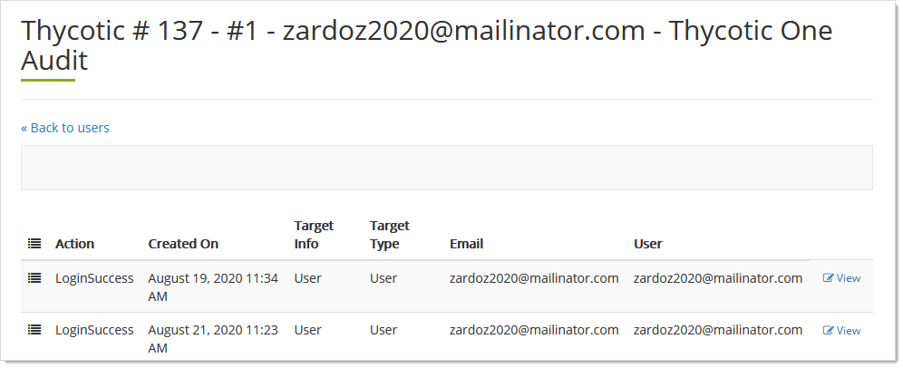

[title]: # (Organization Users)
[tags]: # (Thycotic One, Organizations, Applications, Users)
[priority]: # (1000)

# Organization Users

## Auditing Users

1. Log on to your Cloud Manager at `portal.thycotic.com`.

1. Click the **Manage** link on the dashboard. The Teams page appears.

1. Click the **Organizations** button for the desired team. The Thycotic One Organizations page appears:

   

1. Click the **Users** button for the desired organization. The Thycotic One Users page appears:

   

1. Click the **Audits** button for the target user. An audit of the user's activity appears:

   

1. Click the **View** button to the right an audit action to see details:

   

## Configuring Multifactor Authentication

1. Log on to your Cloud Manager at `portal.thycotic.com`.

1. Click the **Manage** link on the dashboard. The Teams page appears.

1. Click the **Organizations** button for the desired team. The Thycotic One Organizations page appears:

   

1. Click the **Users** button for the desired organization. 

## Editing Organization Users

### Task 1: Edit General Settings

1. Log on to your Cloud Manager at `portal.thycotic.com`.

1. Click the **Manage** link on the dashboard. The Teams page appears.

1. Click the **Organizations** button for the desired team. The Thycotic One Organizations page appears:

   

1. Click the **Users** button for the desired organization. The Thycotic One Users page, which lists all the users, appears:

   

1. Click the **Edit** button. The user's page appears:

   

1. Edit the following as desired:

   - **Name**: This is the user's email address or other unique name.

   - **Enabled**: Allows you to toggle a user's access without having to reenter the user later.

   - **Active**: Read only. This is a flag that indicates if a user has ever logged on.

   - **Locked Out**: Read only. Toggle the setting on the user row on the users table. 

1. Click the **Save** button. You are returned to the Users page.

### Task 2: Setting Phone Numbers

1. Click the **Phone** button next to the desired user on the User page. That user's Phones page appears:

   

1. New phone numbers:

   1. Click the **+ New** button. A popup appears:

      

   1. Type the phone parameters in the text boxes. No not include hyphens or parentheses.

   1. Click the **Save** button. The number appears in the Phones list:

      

      > **Note:** Verification occurs when the user logs on Thycotic One and and goes to the Phone page to run a verification.

1. Existing phone numbers:

   - Click the **Edit** button to change the number.
   - Click the **Set Primary Phone** button to toggle the phone as the user's main phone.
   - Click the **Delete** button to remove the phone number.

1. Click the **Back to users** link to return to the **Users** page.

### Task 3: Setting Email Addresses

1. Back on the **Users** page click the **Emails** link. The user's Emails page appears:

   

1. Existing email addresses:

   - Click the **Edit** button to change the address.
   - Click the **Set Primary** button to toggle the email address as the user's main one.
   - Click the **Verify** button to send a verification email to the user. When the user verifies a green checkmark appears.
   - Click the **Reset Password** button to send the user a password reset email.
   - Click the **Delete** button to remove the phone number.

1. New email addresses:

   1. Click the **+ New** button. A popup appears for you to type the address.
   1. Click the **Save** button. The new address appears in the table as unverified.
   1. Click the **Verify** button to send a verification email to the user. When the user verifies a green checkmark appears.
   1. Click the **Edit** button to configure the user.

### Task 4: View Two-Factor Authentication Status

> **Note:** This is an organization-level parameter, which is why it is read only.

1. Back on the **Users** page click the **Two-Factor** button. The Thycotic One Two-Factor Authentication page appears:
   
   
   
1. Click the **Back to users** link to return to the **Users** page.

## Enabling Thycotic One Users

See [Editing Organization Users](#editing-organization-users).

## Listing Thycotic One Users

See [Editing Organization Users](#editing-organization-users).

## Setting Phone Numbers and Email

See [Editing Organization Users](#editing-organization-users).

## Unlocking a User Account

1. Log on to your Cloud Manager at `portal.thycotic.com`.

1. Click the **Manage** link on the dashboard. The Teams page appears.

1. Click the **Organizations** button for the desired team. The Thycotic One Organizations page appears:

   

1. Click the **Users** button for the desired organization. The Thycotic One Users page, which lists all the users, appears:

   

1. Click the **Unlock** button to unlock the account.

